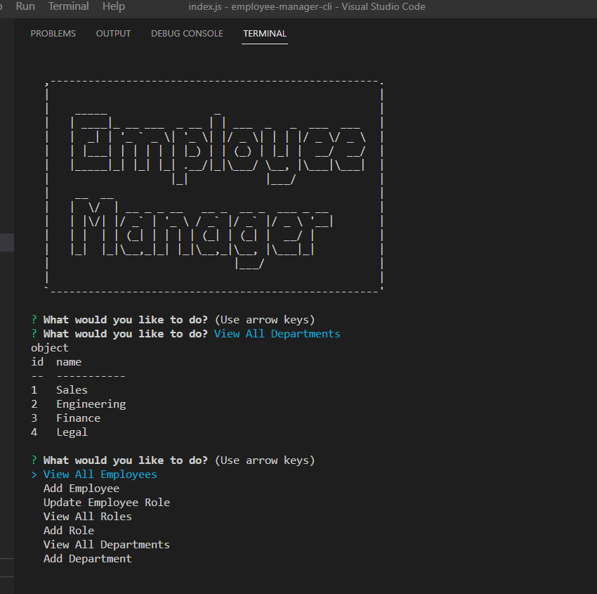

  

  # employee-manager-cli

  ## Description
  
  This repositoy contains the files for an employee managing system. A database of tables that include employees, departments, and roles are combined together using node mysql to track roles, id's, salaries, and managers. This app uses a command line interface from node inquirer to show and change the data.

  ## Table of Contents

- [Installation](#installation)
- [Usage](#usage)
- [License](#license)
- [Contributing](#contribution)
- [Tests](#tests)
- [Questions](#questions)

## Installation

Go to https://github.com/joaqsala/employee-manager-cli and clone the repository. Open the contents in VS Code. In the terminal, install all dependencies using npm i. Run the app using node index.js.

## Usage 

Video walk through: https://watch.screencastify.com/v/ZCVjqE6fT8U1XhuhXdaN

With the application open in VS Code or other editor, run node index.js. A dropdown menu will appear giving you the option View All Employees, Add Employee, Update Employee Role, View All Roles, Add Role, View All Departments, or Add Department. Scroll down the list and choose any of the options to see or edit the exising database.

## License

This project is covered under the MIT License.
 
  https://opensource.org/license/mit/

## Contribution

Contributions are always welcomed. Please submit a pull request.

## Tests

Test the app by adding and editing employees, and then viewing the results.

## Questions

For any questions, please feel free to reach out. 

Github username: https://github.com/joaqsala

Email: joaqsala@gmail.com
